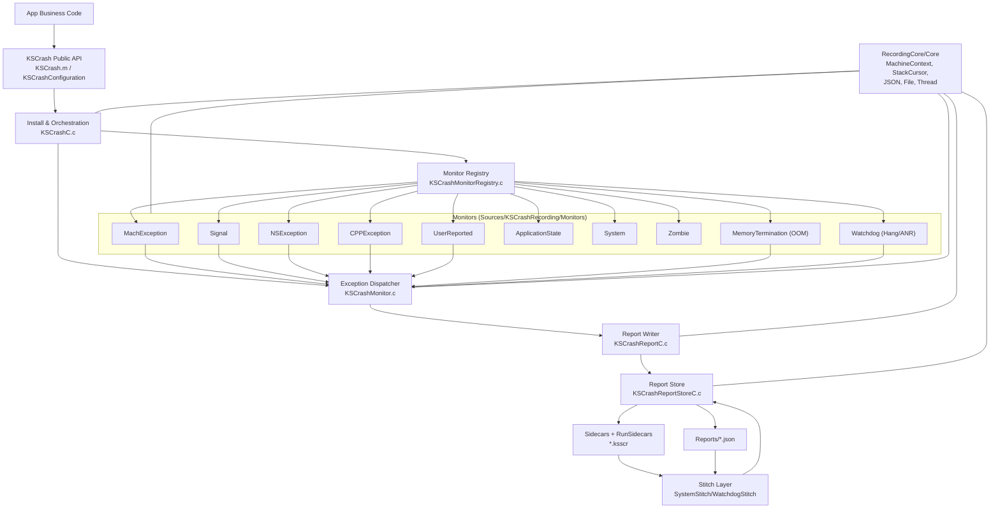

# KSCrash Code Architecture (源码结构深度图解)

## 1. 代码结构分层（按职责）

| 层 | 模块/目录 | 主要职责 | 关键入口 |
|---|---|---|---|
| Public API | `Sources/KSCrashRecording` | 给业务方提供安装、配置、上报入口 | `KSCrash.installWithConfiguration` (`Sources/KSCrashRecording/KSCrash.m:302`) |
| Install / Orchestration | `KSCrashC.c` + `KSCrashMonitor.c` + `KSCrashMonitorRegistry.c` | monitor 注册/激活、异常调度、回调编排、重入控制 | `kscrash_install` (`Sources/KSCrashRecording/KSCrashC.c:353`) |
| Monitor 实现层 | `Sources/KSCrashRecording/Monitors` | 捕获不同异常源并填充 `KSCrash_MonitorContext` | `Signal/Mach/NSException/CPP/Watchdog/Memory` |
| Report Writer | `KSCrashReportC.c` | 把 `MonitorContext` 写成标准/最小化(recrash)报告 | `kscrashreport_writeStandardReport` (`Sources/KSCrashRecording/KSCrashReportC.c:1734`) |
| Store / Sidecar | `KSCrashReportStoreC.c` + `*Stitch.m` | 报告落盘、ID管理、sidecar 拼接、读取修复 | `readReportAtPath` (`Sources/KSCrashRecording/KSCrashReportStoreC.c:510`) |
| Core 支撑库 | `KSCrashRecordingCore` + `KSCrashCore` | 线程/寄存器/栈回溯/JSON/文件等底层能力 | `KSMachineContext`, `KSStackCursor`, `KSJSONCodec` |

## 2. 架构图（Mermaid）

## 3. 关键设计点（对稳定性工程很重要）

1. **监控层可插拔**：`KSCrashMonitorAPI` 定义统一 monitor 协议（init/setEnabled/addContext/stitch），支持内建 monitor 与插件 monitor (`Sources/KSCrashRecordingCore/include/KSCrashMonitorAPI.h:57`)。  
2. **异常处理与采集解耦**：各 monitor 只负责“捕获 + 填充上下文”，真正的写盘在统一回调 `onExceptionEvent` 中完成 (`Sources/KSCrashRecording/KSCrashC.c:204`)。  
3. **重入/二次崩溃保护**：`KSCrashMonitor.c` 对 normal/recrash/crash-loop 做分流，极端情况下 `exitImmediately` 或 `_exit(1)`，防止无限递归崩溃 (`Sources/KSCrashRecordingCore/KSCrashMonitor.c:205`)。  
4. **sidecar 架构**：把不适合在崩溃现场做重处理的数据拆到 sidecar（per-run/per-report），读取时 stitch 回主报告，降低崩溃现场复杂度 (`Sources/KSCrashRecording/KSCrashReportStoreC.c:528`)。  
5. **OOM/ANR 可观测性补齐**：通过 `MemoryTermination` 与 `Watchdog` 走“近似崩溃”路径，补全系统无标准 crash log 的场景。  

