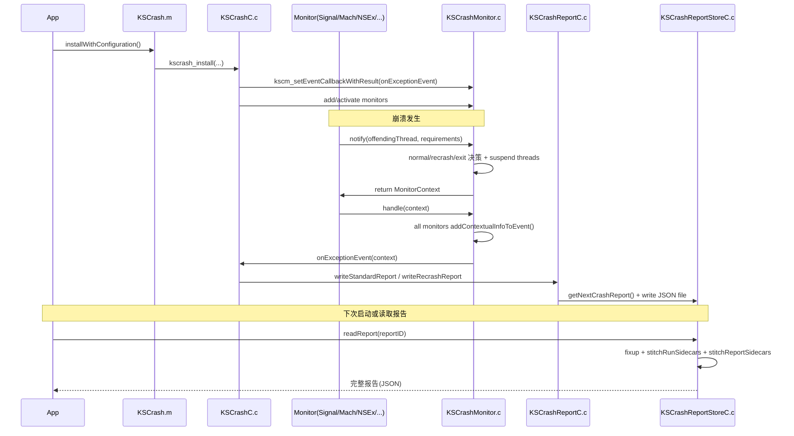

# KSCrash 崩溃采集主链路深度分析

## 0. 结论先行

KSCrash 的主链路是一个“**双阶段采集系统**”：

1. **崩溃现场阶段（Crash-time）**：monitor 捕获异常 -> `notify` 决策（async-safe/recrash/是否写报告）-> 汇总上下文 -> 写标准或最小化报告到本地。  
2. **读取交付阶段（Next-launch/Delivery-time）**：读取报告时做 fixup + sidecar stitching（system/watchdog 等），把运行时分散数据拼回完整报告再交给上层发送。

这套设计对稳定性工程的价值在于：在最危险的 crash-time 路径上尽量小而稳，把复杂处理延迟到安全时机。

---

## 1. 安装阶段：主链路起点

1. `KSCrash.installWithConfiguration` 调 `kscrash_install` 完成底层安装。  
   入口：`Sources/KSCrashRecording/KSCrash.m:302`，`Sources/KSCrashRecording/KSCrashC.c:353`
2. `kscrash_install` 关键步骤：
   - 解析配置并下发到各子系统（内存、回调、introspection 等）`KSCrashC.c:275`
   - 生成 `run_id`（后续用于 run-sidecar 与报告关联）`KSCrashC.c:370`
   - 初始化报告存储目录、sidecar 路径 provider `KSCrashC.c:404-407`
   - 初始化 `memory`/`CrashState`/log 文件/线程缓存/动态链接器 `KSCrashC.c:417-437`
   - 注册统一异常事件回调 `kscm_setEventCallbackWithResult(onExceptionEvent)` `KSCrashC.c:439`
   - 按 bitmask 注册 monitor + plugin monitor，并统一 activate `KSCrashC.c:441-447`
3. monitor 激活由 `kscmr_activateMonitors` 完成，会在调试器场景自动屏蔽 debugger-unsafe monitor（如 Mach）`KSCrashMonitorRegistry.c:112`。

---

## 2. 事件入口：多 monitor 汇入统一调度器

### 2.1 各类异常入口（示例）

1. Signal：`handleSignal` -> `g_callbacks.notify(...)` -> 填充 `signal/signum/faultAddress` -> `handle`  
   `Sources/KSCrashRecording/Monitors/KSCrashMonitor_Signal.c:98`
2. Mach Exception：mach handler 线程收到消息后 `handleException` -> `notify` -> 填充 `mach` + `faultAddress` -> `handle`  
   `Sources/KSCrashRecording/Monitors/KSCrashMonitor_MachException.c:414`
3. NSException：`handleException(NSException*)` 在进入 async-safe 前先抓 exception backtrace，再 `notify`，最后填充 `NSException` + 双栈游标（handler栈 + exception栈）  
   `Sources/KSCrashRecording/Monitors/KSCrashMonitor_NSException.m:101`
4. C++：`std::terminate` handler 里 `notify`，并尽量拿到 throw-site 与 terminate-site 两套栈  
   `Sources/KSCrashRecording/Monitors/KSCrashMonitor_CPPException.cpp:139`
5. User Report：业务主动上报调用 `kscm_reportUserException` 走同一套 `notify -> handle` 管线  
   `Sources/KSCrashRecording/Monitors/KSCrashMonitor_User.c:46`
6. Watchdog/Hang：watchdog 线程检测卡顿后构造“类 watchdog kill”上下文并写报告  
   `Sources/KSCrashRecording/Monitors/KSCrashMonitor_Watchdog.c:285`
7. Memory/OOM breadcrumb：内存压力过高时写“可能 OOM 线索报告”，下次启动判定并转正  
   `Sources/KSCrashRecording/Monitors/KSCrashMonitor_Memory.m:583`

### 2.2 统一调度：`notifyException` 是核心决策点

`KSCrashMonitor.c` 的 `notifyException` 决定这次事件如何处理（normal/recrash/block/exit）：

1. 识别是否“处理异常过程中再次崩溃”（recrash）`KSCrashMonitor.c:247-268`
2. 如果已陷入 crash loop，直接 `_exit(1)` `KSCrashMonitor.c:259-263`
3. 根据要求选择 context：
   - async-safe 场景：使用预分配 context（避免堆分配）`KSCrashMonitor.c:155-165`
   - 非 async-safe：堆分配 context `KSCrashMonitor.c:166-171`
4. 如果要抓全线程，先 suspend 线程环境，必要时标记 async-safety `KSCrashMonitor.c:285-293`

这一步决定了后续回调可做什么，直接影响 crash-time 稳定性。

---

## 3. 上下文补齐：从“异常点”扩展为“可诊断事件”

`handleException` 会让所有启用 monitor 调 `addContextualInfoToEvent` 往同一个 `KSCrash_MonitorContext` 填字段：  
`Sources/KSCrashRecordingCore/KSCrashMonitor.c:306-309`

关键字段模型见：`Sources/KSCrashRecordingCore/include/KSCrashMonitorContext.h:47`

常见补齐逻辑：

1. `ApplicationState` 补运行时长、前后台、session计数 `KSCrashMonitor_AppState.c:440`
2. `MemoryTermination` 补内存压力、剩余额度，并记录 fatal 标志 `KSCrashMonitor_Memory.m:335`
3. `System` 在崩溃时仅更新动态字段（如 freeMemory），其余通过 run-sidecar 延迟拼接 `KSCrashMonitor_System.m:497`
4. `Signal` 与 `Mach` 互相补映射，尽量保证 error 区字段完整 `Signal.c:245` / `MachException.c:595`

---

## 4. 写报告阶段：标准报告 vs recrash 报告

真正写盘发生在 `onExceptionEvent`：
`Sources/KSCrashRecording/KSCrashC.c:204`

流程：

1. 先执行 `willWriteReportCallback`，允许动态修改 plan（如跳过写报告）`KSCrashC.c:206-215`
2. 正常崩溃：
   - 取下一个 report id 与路径 `kscrs_getNextCrashReport` `KSCrashC.c:229-233`
   - 写标准报告 `kscrashreport_writeStandardReport` `KSCrashC.c:227/232`
3. recrash：
   - 写最小化报告并与旧报告关联 `kscrashreport_writeRecrashReport` `KSCrashC.c:224-226`
4. 成功后回调 `didWriteReportCallback` `KSCrashC.c:239-242`

### 标准报告结构关键点

`kscrashreport_writeStandardReport` 写入：

1. `report` 元信息（含 `run_id`）`KSCrashReportC.c:1756`
2. `process_state`、`system`、`crash.error`、`threads`、`last_exception_backtrace` `KSCrashReportC.c:1771-1784`
3. `user` 与 debug(console) `KSCrashReportC.c:1801-1825`
4. 结束后 `ksjson_endEncode` 持久化 `KSCrashReportC.c:1828`

### recrash 报告意义

`kscrashreport_writeRecrashReport` 会先把旧报告改名 `.old`，再写 minimal 报告并嵌入 recrash 信息，避免处理器崩溃时丢失全部上下文：  
`Sources/KSCrashRecording/KSCrashReportC.c:1611`

---

## 5. 读取与拼接阶段：sidecar 把信息补全

读取报告时：

1. `readReportAtPath` 先 fixup 再 stitch `KSCrashReportStoreC.c:520-533`
2. stitching 顺序是 **run-sidecar -> report-sidecar**，后者可覆盖前者 `KSCrashReportStoreC.c:528-531`
3. `System` sidecar 会把设备/OS/CPU/内存等字段并回 `report.system` `KSCrashMonitor_SystemStitch.m:56`

这就是 KSCrash 将“崩溃现场最小工作量”与“交付前信息完整性”兼顾的核心机制。

---

## 6. OOM 与 ANR（Watchdog）专项链路

## 6.1 OOM 近似检测链路（MemoryTermination）

1. 运行中持续把内存状态写入 mmap 文件 `memory.bin`（抗崩溃持久）`KSCrashMonitor_Memory.m:550`
2. 内存达到 urgent+ 时，按节流策略写 `oom_breadcrumb_report.json` `KSCrashMonitor_Memory.m:248-260,583`
3. 下次启动 `notifyPostSystemEnable` 触发“上一会话是否疑似 OOM”判定 `KSCrashMonitor_Memory.m:428`
4. 若命中，读取 breadcrumb，改写 error 为 memory termination + SIGKILL 后转成正式 user report `KSCrashMonitor_Memory.m:380-415`

## 6.2 ANR/Hang 链路（Watchdog）

1. watchdog 线程检测主线程卡顿，触发 `populateReportForCurrentHang` `KSCrashMonitor_Watchdog.c:285`
2. 构造 `SIGKILL + EXC_CRASH + 0x8badf00d` 语义，并填 Hang 时间区间 `KSCrashMonitor_Watchdog.c:326-343`
3. 报告写出后伴随 sidecar 持续更新 hang endTimestamp/endRole `KSCrashMonitor_Watchdog.c:359,371`
4. 若期间发生真实 fatal crash，watchdog 会删除挂起 hang 报告，避免脏数据污染 `KSCrashMonitor_Watchdog.c:783-811`

---

## 7. 主链路时序图（Mermaid）

---

## 8. 对稳定性面试的高价值表达（可直接复用）

1. KSCrash 不只是“crash 捕获器”，而是把 **异常检测、异常编排、报告序列化、报告拼接** 分层解耦的稳定性平台。  
2. 它最关键的工程点不是“抓到崩溃”，而是 crash-time 的 **async-safety 与重入控制**：recrash 最小化、崩溃循环快速退出、线程挂起时降级策略。  
3. OOM/ANR 这类“无标准 crash log”问题，KSCrash 用 breadcrumb + sidecar + next-launch promotion 做了可观测性闭环。  
4. 这套设计可迁移到业务稳定性基础设施：统一事件上下文、分阶段处理、现场最小化、交付时增强。  

