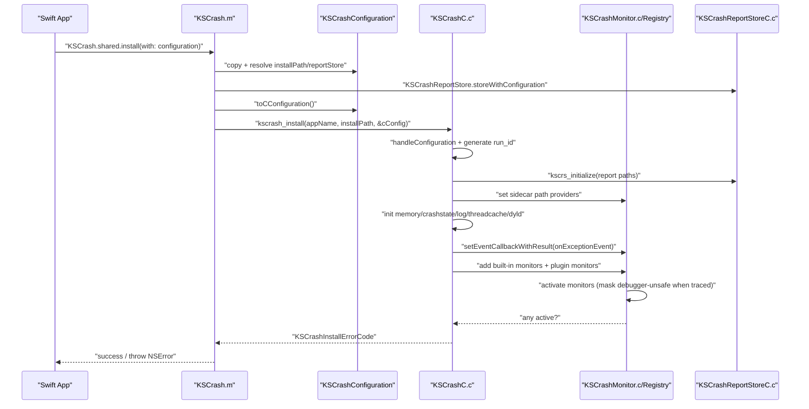

# KSCrash.shared.install(with: configuration) 执行链路深度分析

## 0. 结论先行

`KSCrash.shared.install(with: configuration)` 是一条 **Swift 调用入口 + Obj-C 配置编排 + C 层监控内核安装** 的链路。

核心分 5 层：

1. Swift/Obj-C 桥接层：`KSCrash.shared` + `install(with:)`。
2. Obj-C 安装前置层：配置补全、`ReportStore` 初始化、错误映射。
3. C 层安装层：路径/目录、run_id、内存/状态/日志、sidecar provider。
4. Monitor 注册激活层：按 bitmask 注入 monitor，调试器场景自动屏蔽 unsafe monitor。
5. 崩溃事件回调接管层：`onExceptionEvent` 成为统一写报告入口。

---

## 1. Swift 入口如何落到 Obj-C 方法

### 1.1 `KSCrash.shared` 的来源

`KSCrash` 暴露了类属性：

- `@property(class, atomic, readonly) KSCrash *sharedInstance NS_SWIFT_NAME(shared);`
  见：`Sources/KSCrashRecording/include/KSCrash.h:108`

所以在 Swift 里是：

- `KSCrash.shared`

### 1.2 `install(with:)` 的来源

Obj-C 方法签名是：

- `- (BOOL)installWithConfiguration:(KSCrashConfiguration *)configuration error:(NSError **)error;`
  见：`Sources/KSCrashRecording/include/KSCrash.h:122`

导入到 Swift 后会变成可 `throw` 的：

- `try KSCrash.shared.install(with: configuration)`

样例可见：

- `Samples/Common/Sources/LibraryBridge/InstallBridge.swift:160`

---

## 2. Obj-C 层：`installWithConfiguration:error:` 做了什么

入口实现：

- `Sources/KSCrashRecording/KSCrash.m:302`

执行顺序：

1. 复制配置并补齐默认 `installPath`：
   - `self.configuration = [configuration copy] ?: [KSCrashConfiguration new]`
   - `self.configuration.installPath = configuration.installPath ?: kscrash_getDefaultInstallPath()`
   - 见：`KSCrash.m:304-305`

2. 补齐 report store 配置（`appName`、`reportsPath`）：
   - 若 `appName` 空，用 `bundleName`
   - 若 `reportsPath` 空，用 `installPath/Reports`
   - 见：`KSCrash.m:307-313`

3. 先创建 `KSCrashReportStore`（Obj-C 包装层）：
   - `storeWithConfiguration:error:`
   - 见：`KSCrash.m:314-318`

4. 配置转换到 C 结构体并安装：
   - `KSCrashCConfiguration config = [self.configuration toCConfiguration]`
   - `result = kscrash_install(...)`
   - `KSCrashCConfiguration_Release(&config)`
   - 见：`KSCrash.m:320-323`

5. C 返回非成功时，映射为 `NSError` 并返回 `NO`。
   - 见：`KSCrash.m:324-329`, `KSCrash.m:394-434`

6. 成功后把 `_reportStore` 绑定到实例并返回 `YES`。
   - 见：`KSCrash.m:331-332`

补充：默认安装目录是

- `Library/Caches/KSCrash/<CFBundleName>`
- 由 `kscrash_getDefaultInstallPath()` 计算
- 见：`KSCrash.m:74-88`

---

## 3. 配置对象如何变成 C 配置

入口：

- `Sources/KSCrashRecording/KSCrashConfiguration.m:91`

关键转换点：

1. 默认值来自 `KSCrashCConfiguration_Default()`：
   - 默认 monitors = `KSCrashMonitorTypeProductionSafeMinimal`
   - 见：`include/KSCrashCConfiguration.h:335-363`

2. report store 子配置转 C：
   - `appName/reportsPath/sidecarsPath/runSidecarsPath/maxReportCount`
   - 见：`KSCrashConfiguration.m:230-255`

3. `userInfoJSON`、`doNotIntrospectClasses` 等会被转换成 C 内存（`strdup/malloc`）。

4. callback、plugin monitor（`plugins.apis`）也在这里打包。

5. 安装后统一释放：
   - `KSCrashCConfiguration_Release(&config)`
   - 见：`include/KSCrashCConfiguration.h:366-377`

---

## 4. C 层安装：`kscrash_install` 主干

入口：

- `Sources/KSCrashRecording/KSCrashC.c:353`

主流程（按执行顺序）：

1. 幂等与参数检查：
   - 已安装 -> `AlreadyInstalled`
   - 参数空 -> `InvalidParameter`
   - 见：`KSCrashC.c:358-366`

2. 吃掉配置（全局化）：
   - `handleConfiguration(configuration)`
   - 设置 monitor、回调、introspection、sigterm、console log 开关等
   - 见：`KSCrashC.c:275-329`

3. 生成 `run_id`（UUID）：
   - `uuid_generate` + `uuid_unparse_lower`
   - 见：`KSCrashC.c:370-373`

4. 补齐 report store 路径：
   - `Reports` / `Sidecars` / `RunSidecars`
   - 见：`KSCrashC.c:379-402`

5. 初始化报告存储并绑定 sidecar provider：
   - `kscrs_initialize(&g_reportStoreConfig)`
   - `kscm_setReportSidecarFilePathProvider(...)`
   - `kscm_setReportSidecarPathProvider(...)`
   - `kscm_setRunSidecarPathProvider(...)`
   - 见：`KSCrashC.c:404-407`

6. 初始化运行时数据基础设施：
   - `Data` 目录
   - `ksmemory_initialize(path)`
   - `kscrashstate_initialize(path)`
   - `kslog_setLogFilename(...)`
   - `kstc_init(60)`（线程缓存）
   - `ksdl_init()`（动态链接器）
   - 见：`KSCrashC.c:409-437`

7. 注册统一异常事件回调：
   - `kscm_setEventCallbackWithResult(onExceptionEvent)`
   - 见：`KSCrashC.c:439`

8. 注册 monitor + plugin monitor 并激活：
   - `setMonitors(configuration->monitors)`
   - `setPluginMonitors(...)`
   - `kscm_activateMonitors()`
   - 见：`KSCrashC.c:441-447`

9. 安装完成后标记 + 回放安装前 app 状态：
   - `g_installed = true`
   - `notifyOfBeforeInstallationState()`
   - 见：`KSCrashC.c:449-453`

---

## 5. Monitor 激活的关键行为

### 5.1 debugger 场景会自动屏蔽不安全 monitor

`kscmr_activateMonitors` 会先判断是否被调试器附加：

- `ksdebug_isBeingTraced()`
- 如为 true，会屏蔽 `KSCrashMonitorFlagDebuggerUnsafe` monitor
- 见：`Sources/KSCrashRecordingCore/KSCrashMonitorRegistry.c:112-147`

这就是“调试器下很多 crash 抓不到/链路不完整”的直接原因。

### 5.2 没有任何 monitor 激活会安装失败

- `kscm_activateMonitors() == false` -> `KSCrashInstallErrorNoActiveMonitors`
- 见：`KSCrashC.c:444-447`

---

## 6. 安装后，谁真正写 crash report

安装阶段绑定的 `onExceptionEvent` 是 crash-time 主入口：

- `Sources/KSCrashRecording/KSCrashC.c:204`

它做 3 件关键事：

1. 按 `willWriteReportCallback` 修改处理计划（是否写、是否全线程等）。
2. 正常崩溃写标准报告；recrash 写最小化报告。
3. 写完触发 `didWriteReportCallback`。

并且 monitor 先经 `notify -> handle` 聚合上下文，再交给这个回调。

---

## 7. 时序图（安装链路）

---

## 8. 这条链路里最容易踩的坑

1. **调试器误判**：
   调试器附加时，Mach 等 monitor 可能被屏蔽，导致你以为 install 或 monitor 失效。

2. **只看 Swift 层看不出根因**：
   Swift 只拿到 `throw`，真正原因在 C 层路径构建、monitor 激活、回调注册。

3. **错误码枚举与实际返回存在“未完全覆盖”风险**：
   `KSCrashInstallError` 枚举里有 `CouldNotInitializeStore/Memory/CrashState/SetLogFilename`，
   但 `kscrash_install` 当前主路径里主要返回的是 `AlreadyInstalled/InvalidParameter/PathTooLong/CouldNotCreatePath/NoActiveMonitors`。
   这意味着部分失败会被折叠成更泛化的错误，不利于精细诊断。

4. **ReportStore 初始化有双层**：
   Obj-C `KSCrashReportStore` 和 C `kscrs_initialize` 都会初始化存储目录。不是 bug，但调试时会看到两次相关操作。

---

## 9. 你在 DemoProj 里可直接验证的检查点

1. 启动日志应出现安装成功打印（你已在 `AppDelegate` 加了日志）。
2. 非 debugger 场景触发 `MachBadAccess`，检查是否生成 crash report。
3. report 的 `report.run_id` 与当前 run 区分是否生效。
4. 若你改 monitors，验证 `kscm_activateMonitors` 后是否仍有 active monitor。

---

## 10. 一句话总结

`KSCrash.shared.install(with:)` 本质是在 app 启动早期，把“崩溃监控能力”从高层 API 下沉为一套可在 crash-time 运行的 C 级异常处理系统，并通过 monitor/callback/report store 三者完成闭环。
